<div align="center">

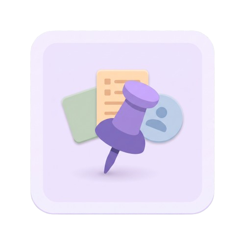

# PinIt

**Want to remember anything or get notified? Just PinIt.**

Pin notes, lists, links, contacts, locations, QR codes, audio, images, PDFs and apps — straight to your notification shade and home screen.

[](LICENSE)
[](https://developer.android.com)
[](https://kotlinlang.org)
[](https://developer.android.com/jetpack/compose)

### No ads · No premium tier · No tracking · 100% open source

</div>

---

## What is PinIt?

**Want to remember anything or get notified? Just PinIt.**

That's the whole pitch. PinIt is an Android notes app that turns *every* type of saved item — a checklist, a phone number, a map location, a QR code, a voice memo — into something you can actually act on without opening the app. Pin a checklist to your notification shade and tick items from there. Pin a contact and call them with one tap. Drop a location on the home screen and navigate to it instantly. Set a reminder and the note pings you at exactly the right moment.

It is built from scratch with Material 3, Jetpack Compose, and Room.

<div align="center">

<!-- ============================================================== -->
<!-- HERO IMAGE                                                     -->
<!-- File: docs/images/hero.png                                     -->
<!-- Recommended: 1080×2400 portrait or wide landscape banner        -->
<!-- ============================================================== -->
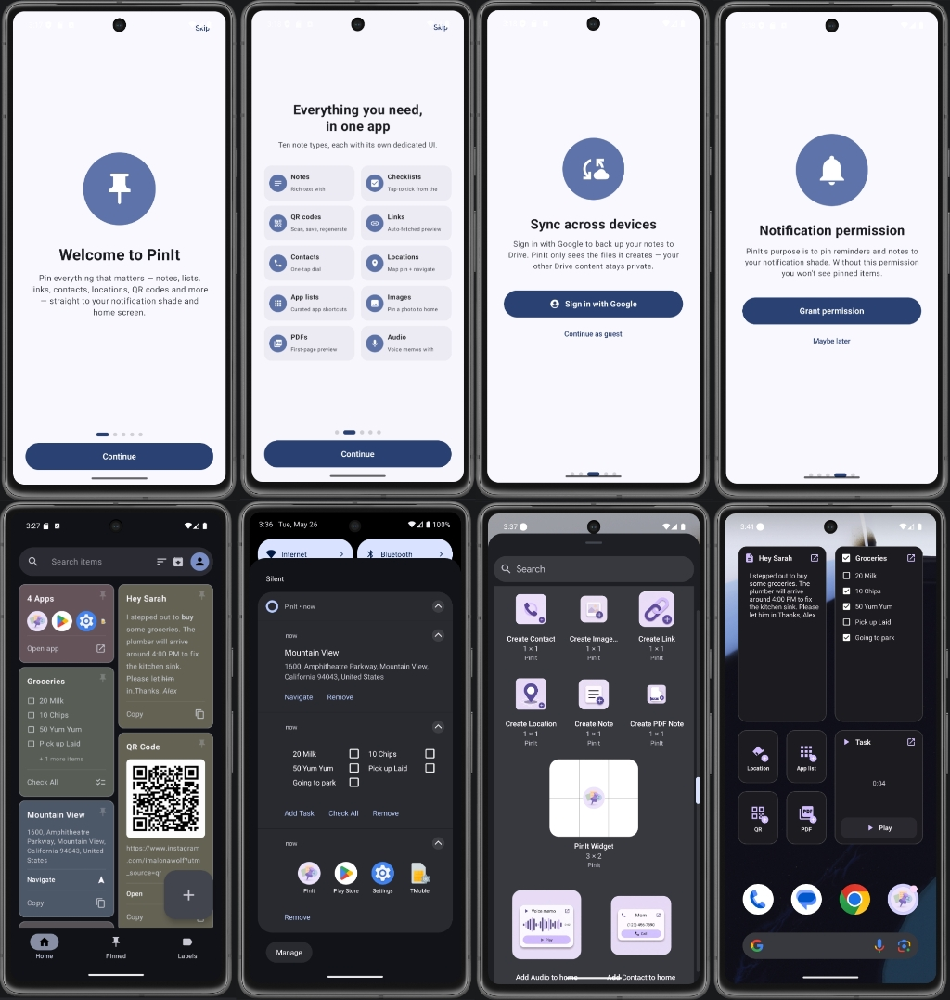

</div>

---

## Features

### 10 note types — every one with its own dedicated UX

| Type | What it does |
|---|---|
| **Note** | Rich-text notes with inline bold / italic / underline / strikethrough |
| **Checklist** | Tap-to-tick items with reorder, plus add-from-notification |
| **QR code** | Scan with camera or import from gallery, save back to gallery |
| **Link** | Auto-fetched preview card with title, description, hero image, video badge |
| **Contact** | Name + phone with system contact picker, one-tap dial |
| **Location** | OpenStreetMap pin with search, tap-to-place, current-location FAB |
| **App list** | Curated row of installed apps you launch together |
| **Image** | Picker or share-to-app, full-screen preview |
| **PDF** | Document picker, first-page thumbnail, native viewer |
| **Audio** | In-app voice recorder with shared playback across notification, widget, card |

### Persistent pins
Every note can be **pinned** to the notification shade with a custom layout that matches its type — checkboxes for lists, big-picture QR codes, dial buttons for contacts, navigate buttons for locations, play/stop for audio. Pins survive reboot.

<div align="center">

<!-- ============================================================== -->
<!-- PERSISTENT PINS — add screenshot(s) here                        -->
<!-- Suggested: docs/images/feature_pins.png                         -->
<!-- ============================================================== -->
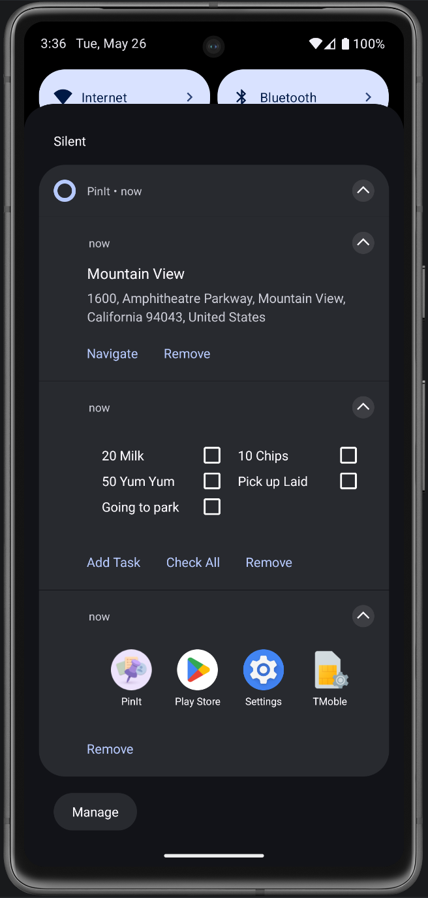

</div>

### 20 home-screen widgets
Ten **Create** widgets (1×1 shortcuts to start a new note of a specific type — tap and you're straight into the editor) and ten **Add** widgets (live-rendering tiles bound to one of your existing notes — they show real content, not just a shortcut). Each widget is type-specific in size: the checklist widget is portrait, the contact widget is short and wide, the image widget is a 3×3 square. All sizes fixed for consistency, no resize-to-mush.

<div align="center">

<!-- ============================================================== -->
<!-- HOME-SCREEN WIDGETS — add screenshot(s) here                    -->
<!-- Suggested: docs/images/feature_widgets.png                      -->
<!-- ============================================================== -->
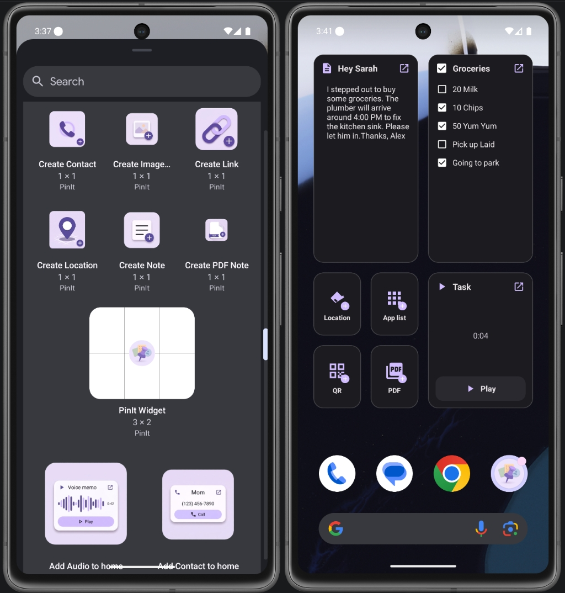

</div>

### Locked notes with blur preview
Mark any note as locked and biometric (fingerprint / face / PIN) auth gates access. The home screen still shows the card, but blurred — you can see *that* a private note exists in its slot without leaking the contents. Tapping prompts for auth before opening; the lock state also blocks the card's quick actions (copy, share, call) until you unlock.

<div align="center">

<!-- ============================================================== -->
<!-- LOCKED NOTES — add screenshot(s) here                           -->
<!-- Suggested: docs/images/feature_locked.png                       -->
<!-- ============================================================== -->
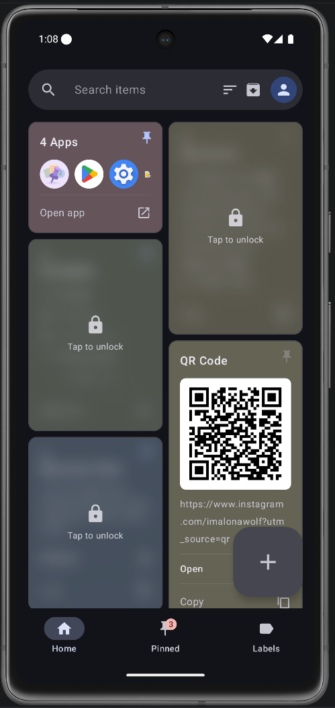

</div>

### Sort + drag-to-reorder
Five sort orders: Newest first, Oldest first, Title A→Z, Title Z→A, and **Manual**. Pick Manual and the home screen enters reorder mode — long-press any card to grab it, drag to reposition, watch the staggered grid auto-flow around your finger. Tick (✓) saves the new order; cross (✗) discards. Saved order survives restarts.

<div align="center">

<!-- ============================================================== -->
<!-- SORT + REORDER — add screenshot(s) here                         -->
<!-- Suggested: docs/images/feature_reorder.png                      -->
<!-- ============================================================== -->
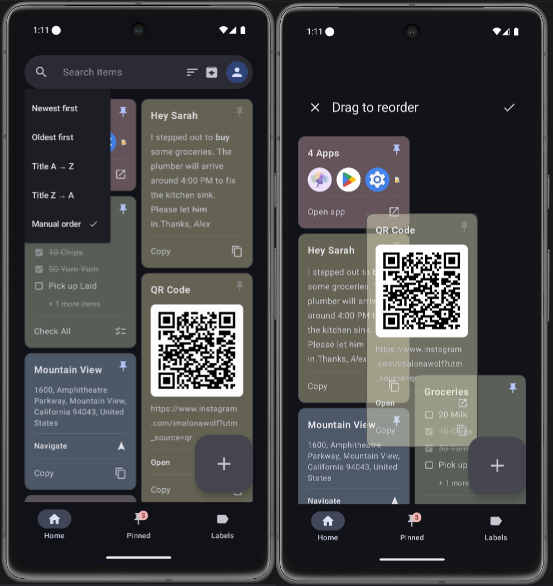

</div>

### Labels (multi-tag organisation)
Apply any number of labels to a note. The Labels tab browses every label you've made with a count badge per label; tap one to filter the home screen down to just those notes. Rename or delete labels with full undo — deleting a label strips it off every note that had it, but undo restores the *exact* prior label state per note (matters when notes had multiple labels).

<div align="center">

<!-- ============================================================== -->
<!-- LABELS — add screenshot(s) here                                 -->
<!-- Suggested: docs/images/feature_labels.png                       -->
<!-- ============================================================== -->
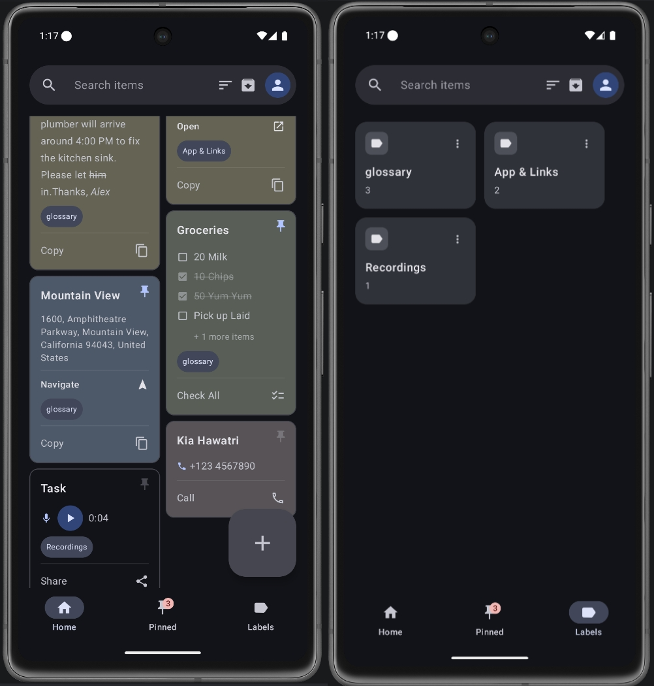

</div>

### Online + offline backup
Two ways to back up, your choice:

- **Online (Google Drive)** — Sign in with Google once, and PinIt creates a `PinIt/` folder in *your* My Drive. Your notes, audio recordings, labels, and reminders sync as a single `pinit_backup.pinit` file. The app uses the **DRIVE_FILE** scope, which means it can *only* see and modify files it created — it has zero access to anything else in your Drive. Sign in on a new device and PinIt auto-merges cloud + local by note timestamp so nothing gets lost.
- **Offline (local file)** — One tap writes a timestamped `pinit_backup_<date>.pinit` file to your `Downloads/PinIt/` folder. Visible in any file manager, transferable over USB, restorable anytime. No account required.

Both formats are the same plain JSON inside, so an offline backup taken on one device can later be uploaded to Drive (or vice versa).

<div align="center">

<!-- ============================================================== -->
<!-- BACKUP — add screenshot(s) here                                 -->
<!-- Suggested: docs/images/feature_backup.png                       -->
<!-- ============================================================== -->


</div>

### Reminders & alarms — get notified at exactly the right moment
Every note can carry a **scheduled reminder** with custom text. Pick a date and time in the editor, type whatever you want the alert to say ("call dentist", "leave for airport", "take medicine"), and PinIt fires an exact alarm at that moment — full notification, sound, vibration, and the note ready to open in one tap.

Under the hood it uses **`AlarmManager.setExactAndAllowWhileIdle`**, which means:

- ⏰ **Exact timing** — alarms fire to the second, not on Android's "approximate" batch schedule. A 9:00 reminder fires at 9:00, not 9:14.
- 🌙 **Doze-resistant** — the `AndIdle` part lets the alarm wake the device even from deep Doze sleep, so a reminder set the night before still fires on time in the morning.
- 🔁 **Reboot-safe** — `BootReceiver` re-arms every pending reminder when your phone restarts, so a reminder you set today still fires next Tuesday after a reboot in between.
- 🛡️ **Permission-aware** — on Android 12+, exact alarms need the `SCHEDULE_EXACT_ALARM` permission. PinIt asks for it during onboarding with a clear explanation; if you skip it, reminders downgrade gracefully to inexact (still fires, just within a ~10-minute window).

Reminders show as a small bell on the note's card so you can see at a glance which ones are scheduled, and the reminder text is preserved across edits — change the note body without losing the alarm.

### Smart extras
- **Archive** — long-press to enter selection mode, archive in bulk with undo, or browse archive separately
- **Pinned tab badge** — count of currently-pinned notes shown on the bottom nav
- **Share-to-PinIt** — receive text, links, images, or `.ics` calendar files from any app
- **ICS import** — drop a calendar invite and it becomes a checklist or note
- **Material You theming** — light / dark / system, dynamic colour where supported
- **Onboarding** — first-launch pager walks new users through features, sign-in, and permission grants

### What we don't do
- ❌ No ads, ever
- ❌ No premium tier, no paywall, no "PinIt Pro"
- ❌ No analytics, no telemetry, no third-party trackers
- ❌ No account required for the core app — sign-in is opt-in for cloud backup only
- ❌ No data collection. Network calls happen only when you fetch a link preview or move the map; everything else stays on your device.

---

## Screenshots

<div align="center">

<!-- ============================================================== -->
<!-- All screenshots live in docs/images/                            -->
<!-- Recommended dimensions: 1080×2400 portrait, PNG, max ~500 KB    -->
<!-- ============================================================== -->

### Home, dark and light

<table>
  <tr>
    <td width="50%" align="center">
      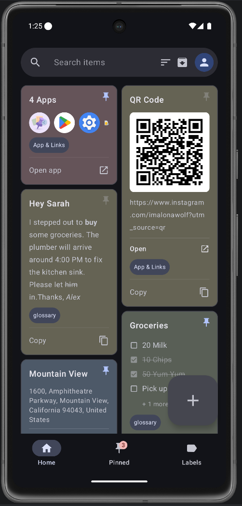<br />
      <sub><b>Home — light</b><br />The staggered grid of notes, with type-specific cards. Tap a card to open, long-press to enter selection mode.</sub>
    </td>
    <td width="50%" align="center">
      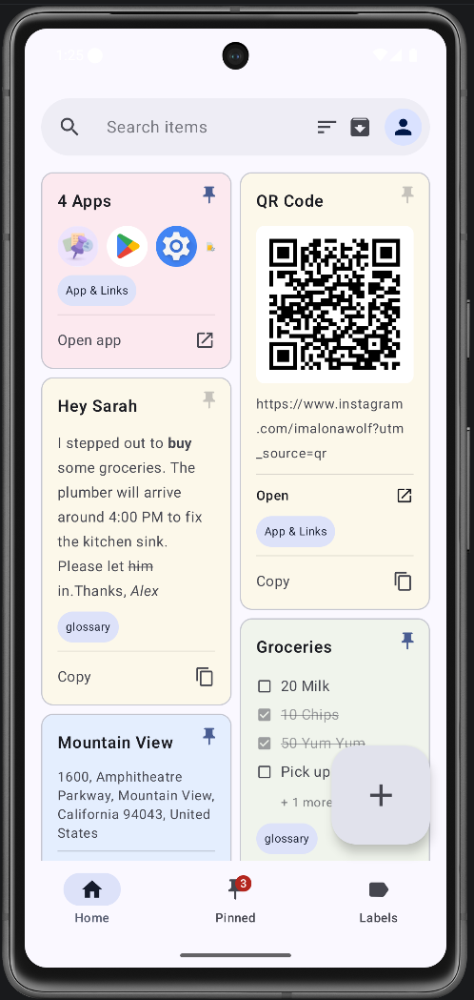<br />
      <sub><b>Home — dark</b><br />Material You dark theme. Same card layout, deeper background, lavender accents from the dynamic palette.</sub>
    </td>
  </tr>
</table>

### 10 note types

<table>
  <tr>
    <td width="33%" align="center">
      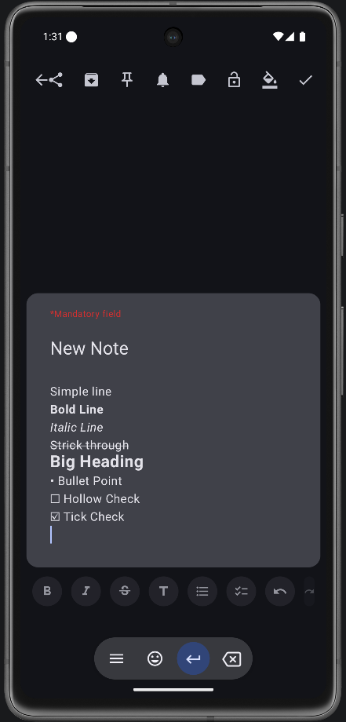<br />
      <sub><b>Rich-text Note</b><br />Inline bold, italic, underline, strikethrough.</sub>
    </td>
    <td width="33%" align="center">
      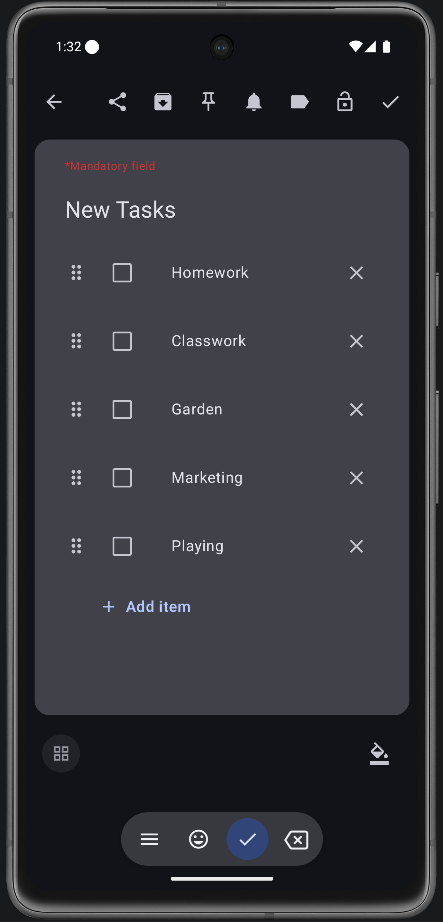<br />
      <sub><b>Checklist</b><br />Tap-to-tick rows, drag-to-reorder, check-all toggle.</sub>
    </td>
    <td width="33%" align="center">
      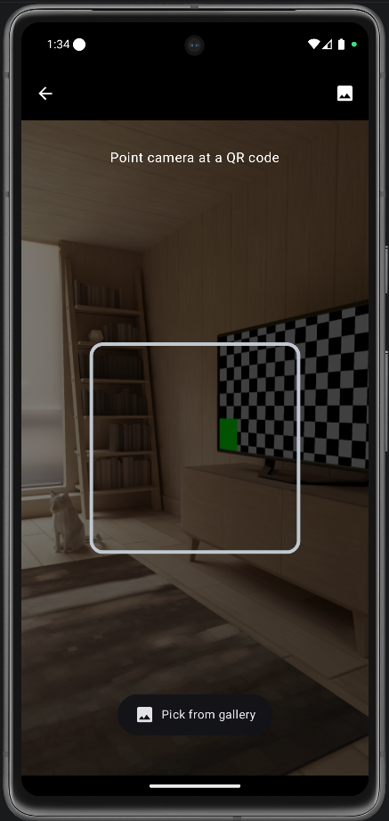<br />
      <sub><b>QR code</b><br />Camera scan or gallery import. Re-renders the QR on demand, save back to gallery.</sub>
    </td>
  </tr>
  <tr>
    <td width="33%" align="center">
      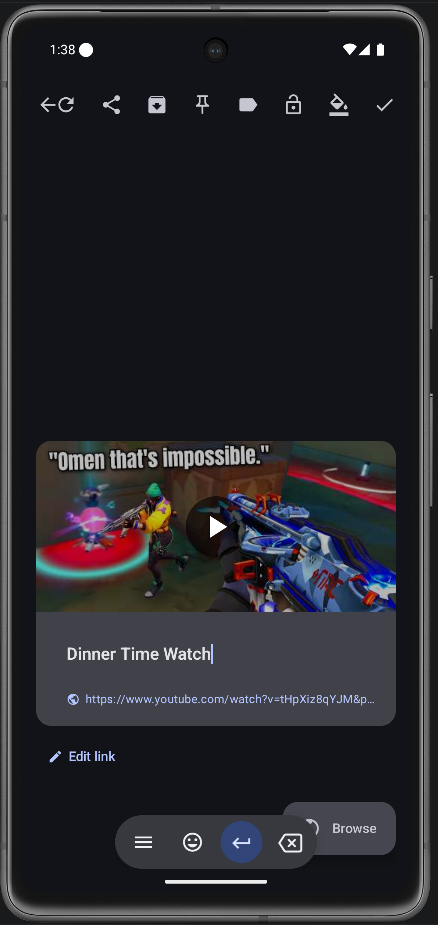<br />
      <sub><b>Link</b><br />Auto-fetched og:image, title and description. Video badge for YouTube / Vimeo / TikTok.</sub>
    </td>
    <td width="33%" align="center">
      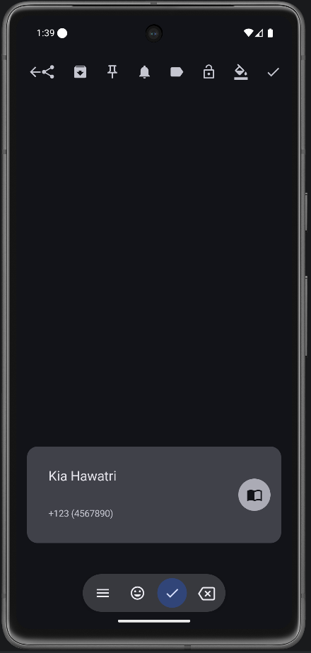<br />
      <sub><b>Contact</b><br />System contact picker, one-tap dial from the card or notification.</sub>
    </td>
    <td width="33%" align="center">
      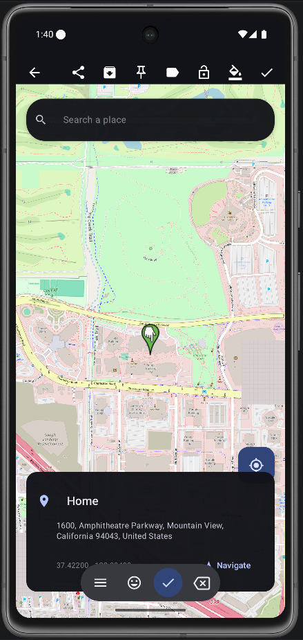<br />
      <sub><b>Location</b><br />OpenStreetMap pin with reverse geocoding. Navigate button fires <code>geo:</code> to your maps app.</sub>
    </td>
  </tr>
  <tr>
    <td width="33%" align="center">
      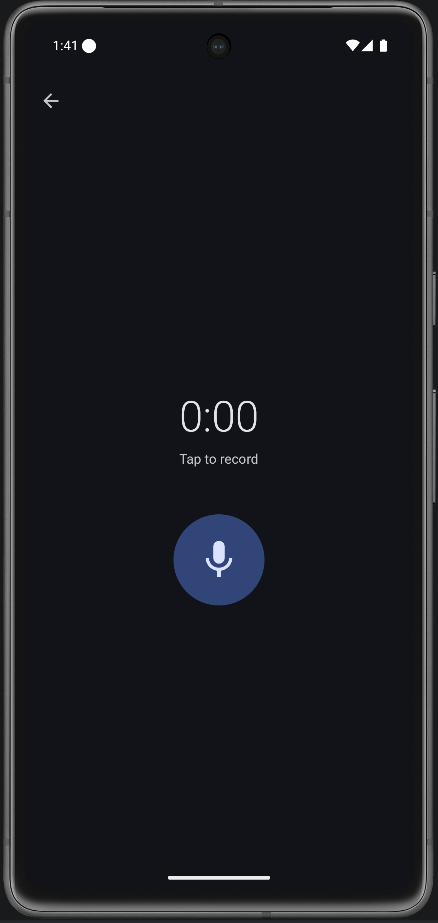<br />
      <sub><b>Audio</b><br />In-app recorder with shared playback across the card, notification, and widget.</sub>
    </td>
    <td width="33%" align="center">
      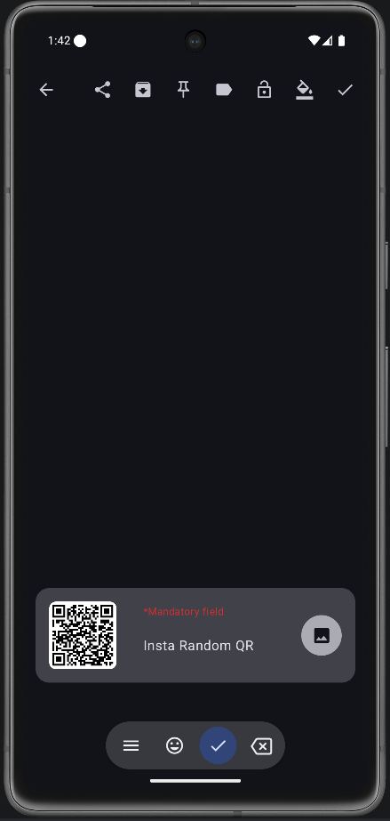<br />
      <sub><b>Image</b><br />Pick from gallery or receive via share. Full-screen preview, share to any app.</sub>
    </td>
    <td width="33%" align="center">
      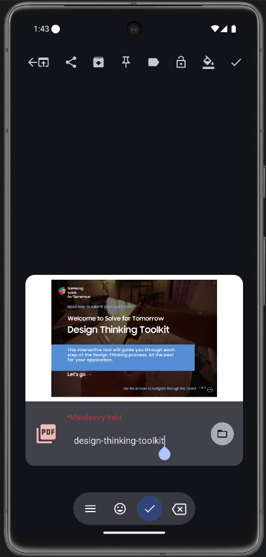<br />
      <sub><b>PDF</b><br />First-page thumbnail rendered on the card. Open in any PDF viewer or share.</sub>
    </td>
  </tr>
</table>

### Persistent notifications

<table>
  <tr>
    <td width="50%" align="center">
      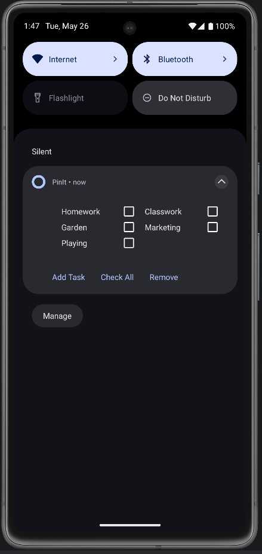<br />
      <sub><b>Checklist on the shade</b><br />Two-column tickable rows, "Add task" inline input, Check all / Remove actions. Survives reboot.</sub>
    </td>
    <td width="50%" align="center">
      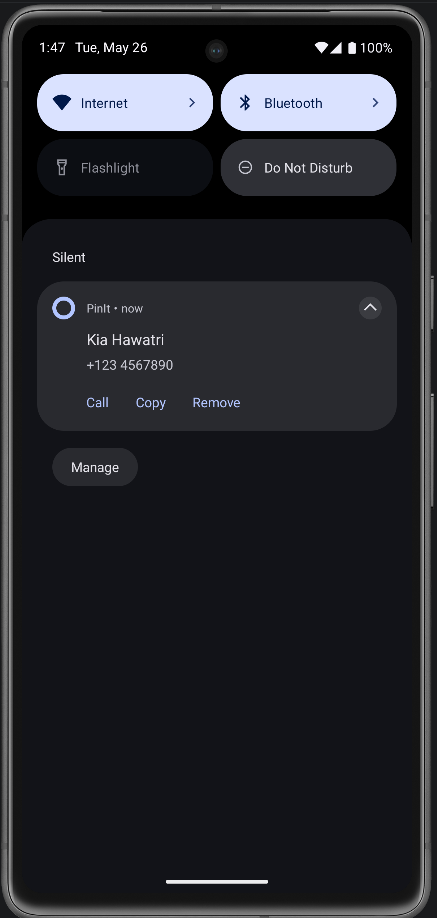<br />
      <sub><b>Contact one-tap dial</b><br />Pin a contact and the notification gets a dedicated <b>Call</b> button — fires the dialler with no extra permission.</sub>
    </td>
  </tr>
  <tr>
    <td width="50%" align="center">
      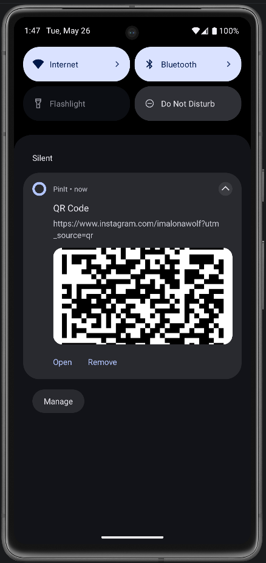<br />
      <sub><b>QR on the shade</b><br />Big-picture style with the regenerated QR bitmap. Open / Copy actions for URL payloads.</sub>
    </td>
    <td width="50%" align="center">
      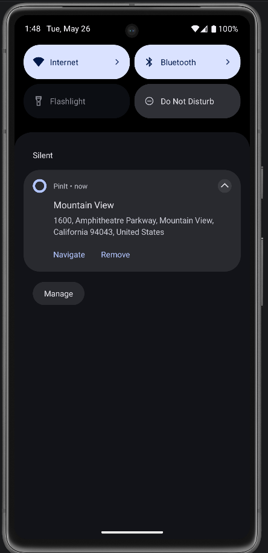<br />
      <sub><b>Location with Navigate</b><br />Address as the body, <b>Navigate</b> action sends a <code>geo:</code> intent to your default maps app.</sub>
    </td>
  </tr>
</table>

### Locked notes & blur preview

<table>
  <tr>
    <td width="50%" align="center">
      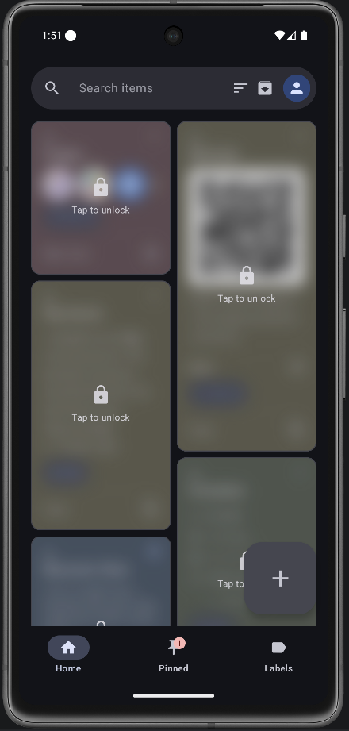<br />
      <sub><b>Blurred preview</b><br />Locked notes still take their slot in the grid, but their contents are blurred. The lock icon overlays the card; quick-action taps are blocked until you unlock.</sub>
    </td>
    <td width="50%" align="center">
      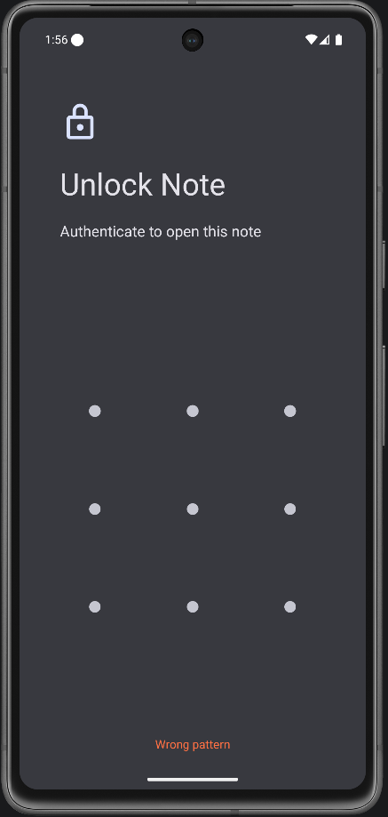<br />
      <sub><b>Biometric prompt</b><br />Tap a locked card → fingerprint / face / PIN. On success the note opens; failure leaves it sealed.</sub>
    </td>
  </tr>
</table>

### Sort + drag to reorder

<table>
  <tr>
    <td width="50%" align="center">
      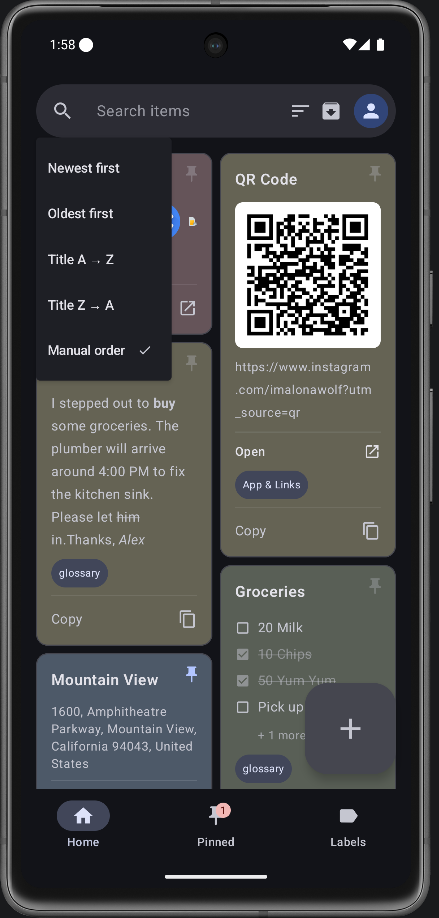<br />
      <sub><b>Sort menu</b><br />Five orders. Newest, Oldest, Title A→Z, Title Z→A, and Manual. Tap Manual to enter drag mode.</sub>
    </td>
    <td width="50%" align="center">
      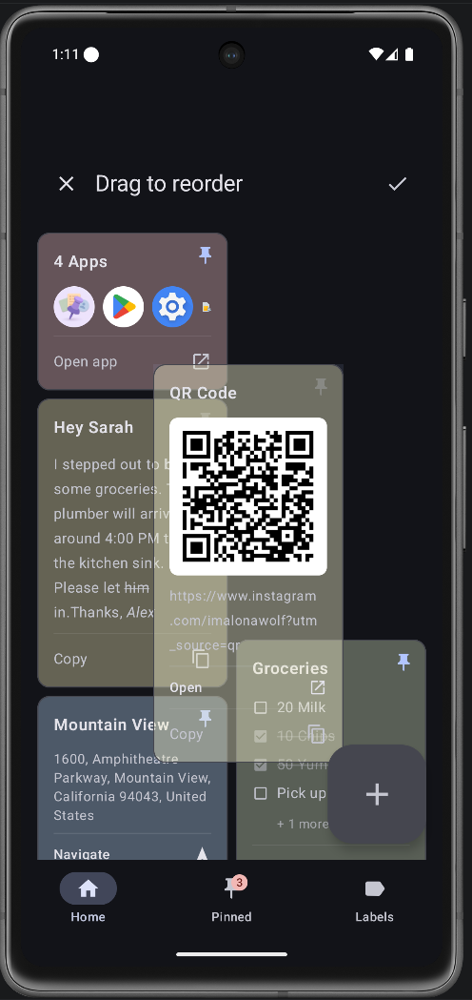<br />
      <sub><b>Manual reorder</b><br />Long-press any card and drag. The grid reflows live. ✓ saves the new order; ✗ discards. Order survives app restarts.</sub>
    </td>
  </tr>
</table>

### Labels

<table>
  <tr>
    <td width="50%" align="center">
      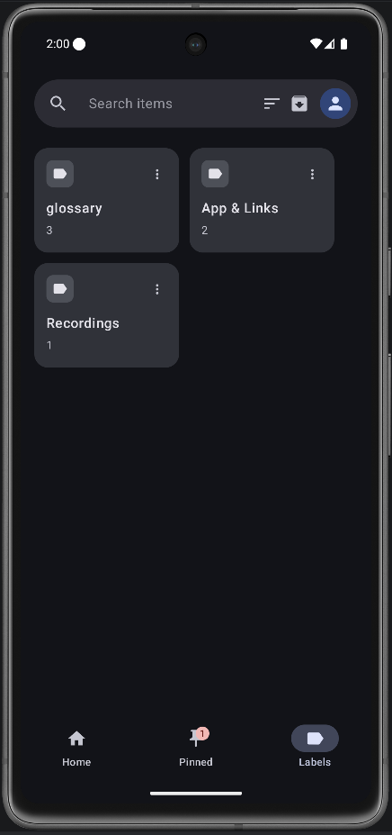<br />
      <sub><b>Labels tab</b><br />Every label you've ever used with a count badge. Tap to filter, kebab menu to rename or delete.</sub>
    </td>
    <td width="50%" align="center">
      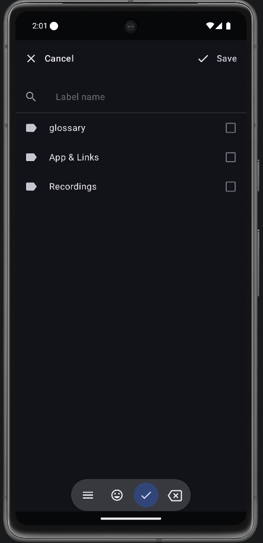<br />
      <sub><b>Apply labels</b><br />Full-screen sheet on every editor. Search, create new on the fly, multi-select. Rename / delete with full undo.</sub>
    </td>
  </tr>
</table>

### Home-screen widgets

<table>
  <tr>
    <td width="33%" align="center">
      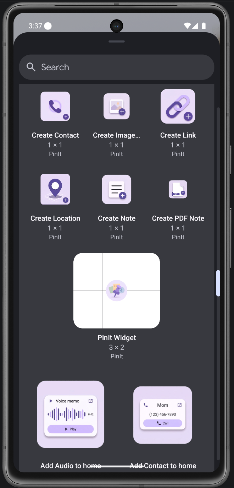<br />
      <sub><b>20 widgets in the picker</b><br />Ten <b>Create</b> shortcuts and ten <b>Add</b> live-rendering tiles. Each gets its own preview image and label.</sub>
    </td>
    <td width="33%" align="center">
      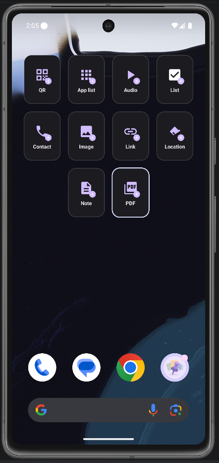<br />
      <sub><b>Create widget</b><br />1×1 tile with a type icon and a + badge. Tap to jump straight into a new note of that type.</sub>
    </td>
    <td width="33%" align="center">
      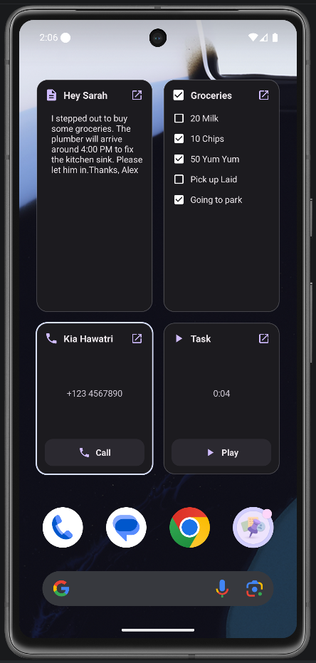<br />
      <sub><b>Add widget</b><br />Live-renders a chosen note. Lists are tickable from the home screen, audio plays, contacts dial, locations navigate.</sub>
    </td>
  </tr>
</table>

### Backup — online & offline

<table>
  <tr>
    <td width="50%" align="center">
      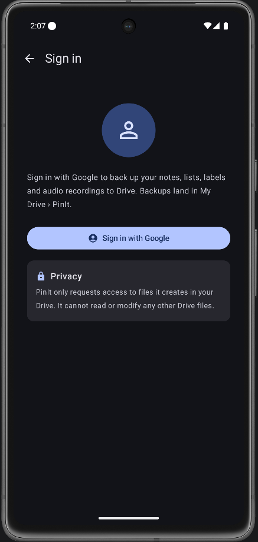<br />
      <sub><b>Online — Google Drive</b><br />One-tap upload to <code>My Drive/PinIt/pinit_backup.pinit</code>. Uses the <code>DRIVE_FILE</code> scope, so PinIt can only see files it created — never the rest of your Drive.</sub>
    </td>
    <td width="50%" align="center">
      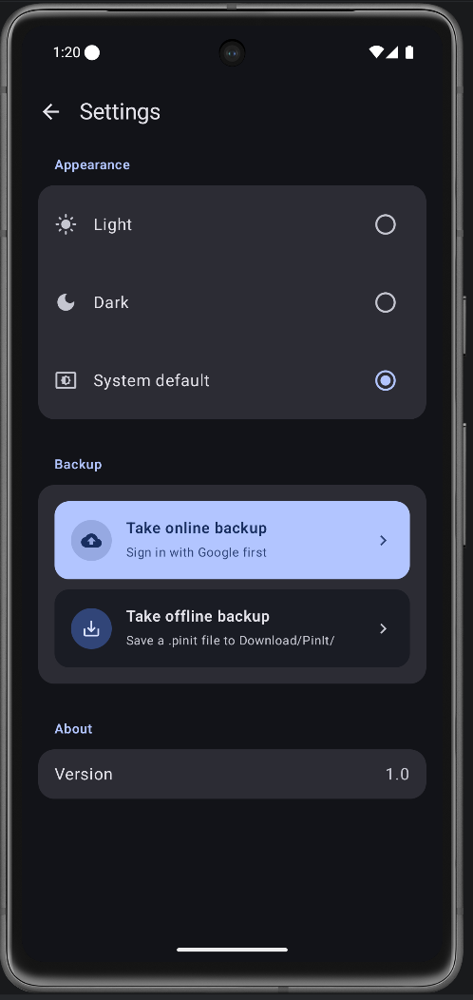<br />
      <sub><b>Offline — local file</b><br />Saves a timestamped <code>.pinit</code> archive to <code>Download/PinIt/</code>. No account, no permissions, transferable over USB.</sub>
    </td>
  </tr>
</table>

</div>

---

## Demo

<div align="center">

<!-- ============================================================== -->
<!-- DEMO VIDEO                                                     -->
<!-- File: docs/videos/demo.mp4 (or demo.gif)                       -->
<!-- For GitHub: prefer .mp4 (uploads inline), or a .gif under 10MB -->
<!-- ============================================================== -->

<video src="docs/videos/demo.mp4" controls width="80%"></video>

<!-- Fallback if your renderer doesn't show the video tag: -->
<!--  -->

</div>

---

## Download

<div align="center">

PinIt is distributed exclusively through **GitHub Releases**. There is no Play Store listing — pre-built APKs are signed and posted to the [releases page](../../releases) for every tagged version.

<a href="../../releases/latest"></a>

</div>

> **Note for first install:** because PinIt isn't on the Play Store, you'll need to allow your browser or file manager to install unknown apps the first time. Android will prompt you with a one-time toggle.

---

## Building from source

### Requirements
- Android Studio Ladybug (2024.2) or newer
- JDK 11
- Android SDK 36 (compileSdk) — minimum target Android 10 (API 29)

### Clone & build

```bash
git clone https://github.com/<your-username>/PinIt.git
cd PinIt
./gradlew assembleDebug          # macOS / Linux
gradlew.bat assembleDebug        # Windows PowerShell
```

The debug APK lands in `app/build/outputs/apk/debug/app-debug.apk`.

### Run on a device
```bash
./gradlew installDebug
adb shell am start -n com.hawatri.pinit/.MainActivity
```

### Release build
A release build needs a signing keystore at the project root (`pinit_keystore`). Generate one if needed:

```bash
keytool -genkey -v -keystore pinit_keystore -alias pinit -keyalg RSA -keysize 2048 -validity 10000
```

Then add a `signingConfigs.release` block to `app/build.gradle.kts` and run:

```bash
./gradlew assembleRelease
```

### Cloud backup setup (optional)

If you fork PinIt and want online backup to work in your build, you'll need to register your own OAuth client in Google Cloud Console — Drive API enabled, Android client with **your** package name and **your** keystore's SHA-1 fingerprint. The default build is set up for the upstream project; a forked build will hit `DEVELOPER_ERROR` (status code 10) until you wire up your own client. See `IMPLEMENTATION_LOG.md` for the full walk-through.

---

## Architecture

**MVVM with Room + Compose Navigation.** Single ViewModel, StateFlow-based state, Compose-driven UI.

```
data/          → Room database (Note, NoteDao, NoteDatabase, Converters, NoteType)
viewmodel/     → PinItViewModel
ui/            → Compose screens, FAB menu, NoteCard, LabelsEditor, IcsImportSheet, OnboardingScreen
backup/        → GoogleAuthManager, DriveBackupManager, BackupSyncManager, PinItBackup
receiver/      → NotificationReceiver, AlarmReceiver, BootReceiver
util/          → NotificationHelper, ReminderHelper, QrUtils, PdfUtils, AudioPlayback
widget/        → 20 widget providers + shared renderer / config / service
```

Type-specific data (`LinkNoteData`, `LocationNoteData`, etc.) is stored as JSON inside `note.text`, parsed via Gson. Database migrations are data-preserving — no `fallbackToDestructiveMigration` anywhere.

For deeper architecture notes see [`CLAUDE.md`](CLAUDE.md) and the per-session decision log in [`IMPLEMENTATION_LOG.md`](IMPLEMENTATION_LOG.md).

---

## Tech stack

| Library | Purpose |
|---|---|
| **Kotlin 2.0** + **Coroutines** | Language and async |
| **Jetpack Compose** (Material 3) | UI |
| **Compose Navigation** | Screen routing |
| **Room 2.7** + **KSP** | Local database |
| **CameraX** + **ML Kit Barcode** | QR scanning |
| **osmdroid** | OpenStreetMap (no API key) |
| **ZXing** | QR generation |
| **Coil** | Image loading and Google account avatar |
| **Jsoup** | Link metadata extraction |
| **androidx.biometric** | Locked-note auth |
| **Gson** | JSON serialisation for typed note bodies and `.pinit` backups |
| **Google Sign-In** + **Drive REST v3** | Optional cloud backup (DRIVE_FILE scope only) |
| **sh.calvin.reorderable** | Drag-to-reorder for the staggered grid |

---

## Permissions

PinIt asks only for what each feature needs, when it's needed:

- `POST_NOTIFICATIONS` — pinned-note shade entries (Android 13+)
- `SCHEDULE_EXACT_ALARM` / `USE_EXACT_ALARM` — reminders
- `CAMERA` — QR scanning (gallery import works without it)
- `READ_CONTACTS` — contact picker
- `ACCESS_FINE_LOCATION` / `COARSE_LOCATION` — current-location FAB only
- `RECORD_AUDIO` — voice memos
- `USE_BIOMETRIC` — locked notes
- `RECEIVE_BOOT_COMPLETED` — re-post pinned notifications after restart
- `INTERNET` — link previews, OSM map tiles, Drive backup
- `GET_ACCOUNTS` — list Google accounts for sign-in (only used during the picker)

No analytics, no ads, no third-party trackers. The app talks to the network only when you load a link preview, scroll a map, or run a backup.

---

## Privacy

PinIt's privacy story is short: **everything stays on your device, unless you explicitly back it up.**

- All notes, audio recordings, labels and reminders live in Room (the device's local database) and `filesDir` (your audio recordings).
- Cloud backup is **opt-in**. Until you tap "Sign in with Google," the app makes zero authenticated network calls.
- When you sign in, PinIt requests *only* the **DRIVE_FILE** scope — meaning it can read and write files it itself created in your Drive, and nothing else. It can't see your other documents, photos, or shared drives.
- Backups are written to **your** Google Drive (`My Drive/PinIt/`), in *your* account. PinIt does not run a server, does not have its own database, and does not see your backup contents — the data goes from your phone to your Drive directly.
- Offline backups are written to your local `Download/PinIt/` folder. No network involved.
- No analytics SDKs are included. No crash reporters. No telemetry of any kind.

---

## Contributing

Found a bug or have an idea? Just [open an issue](../../issues/new) — that's the easiest way to get in touch. You can also tap **Report an issue** in the app's Settings screen, which opens your mail app pre-addressed to <kiahawatri@gmail.com>.

---

## Acknowledgements

- **Ruppu** — the original inspiration for the multi-type pin concept
- **OpenStreetMap** — tiles and geocoding for the location feature
- **Material Design 3** — the visual system PinIt is built on

---

## License

PinIt is released under the [MIT License](LICENSE). You're free to use, modify, and distribute it, including for commercial purposes — just keep the copyright notice intact.

---

<div align="center">
<sub>Made with care by <a href="https://github.com/<your-username>">Kia Hawatri</a></sub>
</div>
